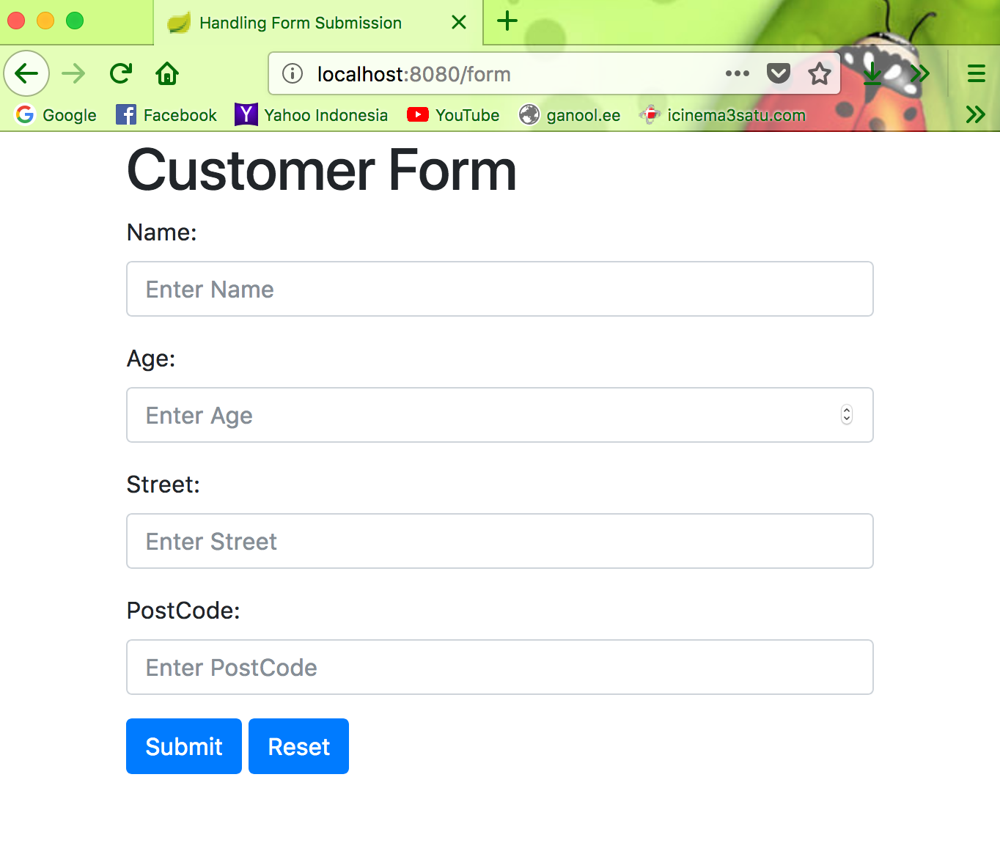
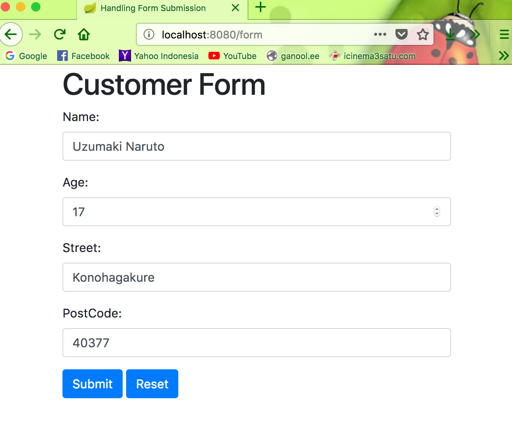
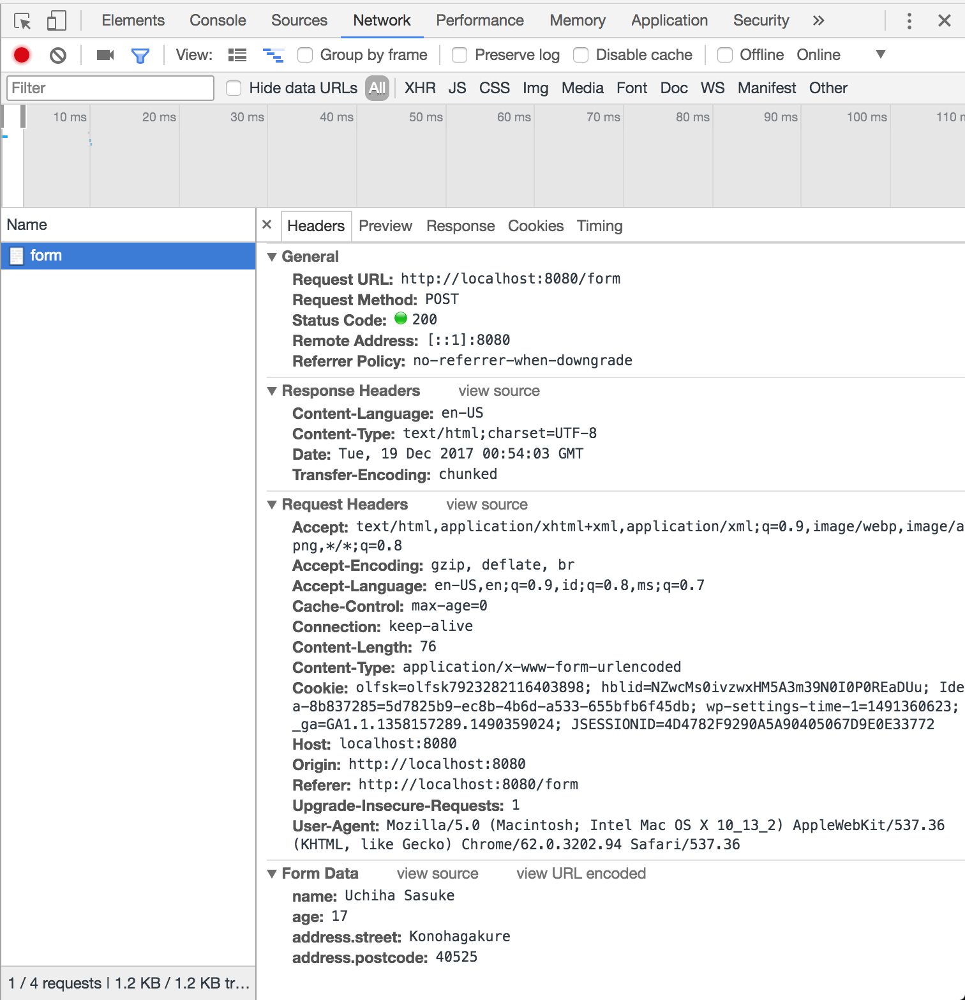

# Kotlin-Form-Submission

#### Kotlin SpringMVC Form Submission – with Thymeleaf + SpringBoot + Boostrap 4 Form

Run this repo by :

`mvn clean spring-boot:run`

Home Page

Input Form Page

Response Page

